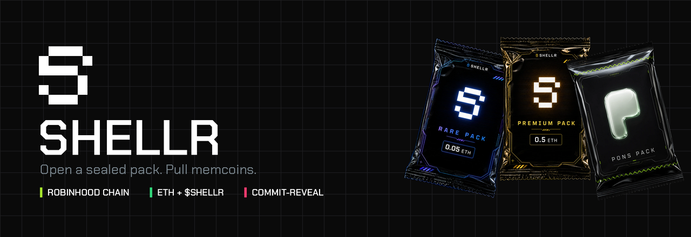
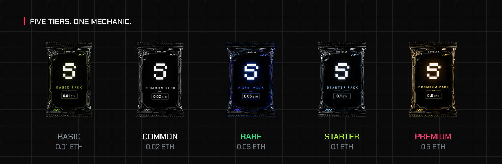

<div align="center">



<br /><br />

[](https://shellr.trade)

[](https://github.com/Shellr-Packs/shellr-contracts#provable-fairness)
[](#a-standing-warning)
[](https://x.com/shellr_co)

</div>

---

## What this is

You buy a sealed pack for a fixed price in ETH. You tear it open. Several
memcoins fall out, in your wallet, on Robinhood Chain. Keep them, or sell them
back on the spot.

That is the whole product. Everything in these repositories exists to make two
claims about it true rather than advertised:

**The pack cannot be rigged after you buy it.** Robinhood Chain has no
Chainlink VRF, so randomness here is commit-reveal. The operator queues a batch
of `keccak256(secret)` commitments *before* anyone buys. Your pack takes the
next one at the moment of purchase and mixes in a seed you chose. Neither side
can steer the result: the operator was committed before your seed existed, and
you never saw the secret. After the pack settles, the secret is in the reveal
calldata and anyone can recompute the draw from public data.

**The house edge is arithmetic, not vibes.** A pack does not spend your stake.
It spends your stake times a multiplier drawn from the same seed, across seven
bands. The odds of each band and the ends of each multiplier are public state
on the contract, so they can be read directly rather than taken on trust, and
`expectedPayoutBps` in the SDK turns them into the mean they imply. Read them
off the chain: what a README claims and what the contract enforces are two
different things, and only one of them decides your pack.

<div align="center">



</div>

Five fixed tiers, plus a **Pons Pack** that prices itself off whatever stake you
name and can only reach coins launched on the Pons launchpad. Packs can also be
paid for in **$SHELLR** at a 30% discount, in which case the contract keeps the
token and funds the pack out of its own bankroll instead of swapping.

---

## Repositories

| | What it is | Stack |
|---|---|---|
| [**shellr-contracts**](https://github.com/Shellr-Packs/shellr-contracts) | `ShellrPacks`, `ShellrStockPacks`, `ShellrStaking`. The draw, the bankroll, the commit queue. | Solidity 0.8.26, Foundry |
| [**shellr-web**](https://github.com/Shellr-Packs/shellr-web) | shellr.trade. The pack-opening theatre, the vault, staking, the stock desk. | Next.js 16, wagmi, three.js |
| [**shellr-keeper**](https://github.com/Shellr-Packs/shellr-keeper) | Keeps the seed queue full and reveals every pack. One process, no database. | Node 20, viem, Railway |
| [**shellr-sdk**](https://github.com/Shellr-Packs/shellr-sdk) | Reads, calldata, and `verifyPack` - recompute a settled pack and check it. | TypeScript, viem |
| [**shellr-stock-packs**](https://github.com/Shellr-Packs/shellr-stock-packs) | One tokenized share per pack, routed through Voxelithic's book. | TypeScript, viem |

The one worth reading first is **shellr-sdk**. It contains a mirror of the
contract's draw, which means the fairness claim above is something you can run
rather than something you have to believe.

```ts
import { createPublicClient, http } from "viem";
import { robinhoodChain, readDrawConfig, readPack, verifyPack } from "@shellr/sdk";

const client = createPublicClient({ chain: robinhoodChain, transport: http() });

// Addresses are yours to supply - the SDK ships none.
const config = await readDrawConfig(client, packsAddress);
const pack = await readPack(client, 1337n, packsAddress);

const { ok, reason, drawn } = verifyPack(pack, config);
//  ok    -> the revealed secret hashes to the commitment queued before the buy,
//           and the recomputed draw matches what the contract paid out
//  drawn -> which coins, at what multiplier, for how much each
```

---

---

## A standing warning

**None of these contracts have been audited.** They hold buyer ETH between
`buy` and `reveal` and they approve a router to spend it. That is why
`maxStake` ships at 0.25 ETH and why `pause()` exists. Both are load-bearing,
not decorative.

Two more things that are true and are easier to say here than to discover:

- **A pack is a gamble.** The expected return is under what you paid, on
  purpose, and that is how the thing is funded. Do not buy packs with money you
  need.
- **The keeper's key is hot** and **`MASTER_SECRET` is not rotatable.** Every
  commitment already on chain was derived from it. Losing it refunds every pack
  in flight; leaking it lets someone predict a pack before buying it. They
  still cannot change the outcome, but they can wait for a good one.

Found something? [SECURITY.md](https://github.com/Shellr-Packs/.github/blob/main/SECURITY.md).

<div align="center">
<br />

<br /><br />
<sub><a href="https://shellr.trade">shellr.trade</a> · <a href="https://x.com/shellr_co">@shellr_co</a></sub>
</div>
